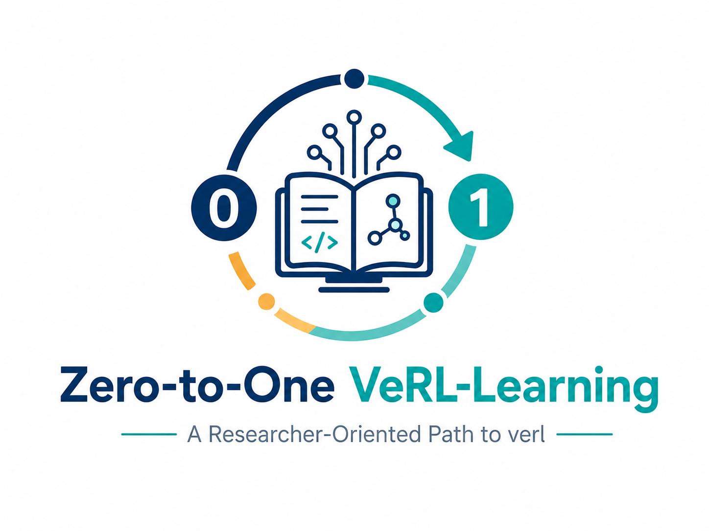

<p align="center"></p>

# Zero-to-One verl Learning

> 面向 Agentic RL / LLM 后训练初学者的 verl 上手笔记：定位核心文件，快速自定义 Agent 与 Reward。

**基于 verl**：[`v0.8.0`](https://github.com/volcengine/verl)  
**语言**：中文（主） · 英文（后续）  
**状态**：WIP

---

## 这是什么

<!-- TODO: 用 2–3 句话补充你的个人动机 / 本笔记的独特角度 -->

本仓库既是作者学习 [verl](https://github.com/volcengine/verl) 的笔记，也面向**使用 verl 做 LLM RL / Agentic RL 后训练的初学者**，帮助你：

- 知道从何处入手使用 verl
- 如何阅读与修改训练相关的参数配置
- 如何自定义 Agent 逻辑与奖励（Reward）设计

读完后，你应能：**自定义 Agent 逻辑、改对关键配置、知道结果/指标从哪看**；并以一个现实例子把整条链路跑通。

## 这不是什么

- 不是官方文档的替代品（安装细节、完整 API 仍以 [verl docs](https://verl.readthedocs.io/) 为准）
- 不深入 verl 底层 infra 优化（FSDP / Megatron / 调度与性能调参等）
- <!-- TODO: 按需补充其他非目标 -->

## 适合谁

- 有一定 RL / LLM 基础，想用 verl 做后训练或 Agentic RL
- 更关心「改 Agent / Reward / Config」，而不是分布式训练工程细节
- <!-- TODO: 补充你期望的读者背景，例如是否需要会 PyTorch、是否做过 PPO -->

## 学习路径（第一周）

| 步骤 | 内容 | 状态 |
|------|------|------|
| 0 | [环境准备与常见坑](docs/00-setup-pitfalls.md) | WIP |
| 1 | [核心文件地图（File Map）](docs/01-file-map.md) | WIP |
| 2 | <!-- TODO: 例如 Hello AgentLoop --> | 计划中 |
| 3 | <!-- TODO: 例如自定义 Reward --> | 计划中 |
| 4 | <!-- TODO: 现实例子，如 Search-R1 × AgentLoop --> | 计划中 |

## 仓库结构

```text
Zero-to-One-verl-learning/
├── README.md
├── LICENSE
├── assets/          # 图标与图片资源
├── docs/            # 主体文档
└── examples/        # 可运行示例（后续）
```

## 贡献与反馈

项目早期，欢迎直接开 Issue 讨论文档缺口、API 漂移或示例需求。  
<!-- TODO: 稳定后补充 CONTRIBUTING.md / PR 约定 -->

## License

[MIT](LICENSE)
