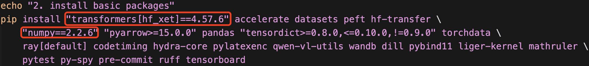

# 环境准备与常见坑

> 基于 verl **v0.8.0**。补充 [verl 官方安装文档](https://verl.readthedocs.io/en/latest/start/install.html) 未覆盖的实际踩坑，旨在为后续快速搭建 verl 实验环境提供一份环境准备指南。

**状态**：WIP

## 环境要求

本文使用 `uv / conda / pip` 进行安装，不涉及 docker。同时，在如下测试环境中验证可行：

- Linux：Ubuntu 22.04
- Python：3.12
- CUDA：12.8

## 安装步骤（最小）

1. **创建虚拟环境**（此处使用 conda，可考虑替换为 uv）

```bash
conda create -n verl python=3.12
conda activate verl
# 升级基础构建工具
python -m pip install --upgrade pip setuptools wheel
```

2. **下载 verl 源码**

```bash
git clone https://github.com/verl-project/verl.git && cd verl
```

3. **修改安装脚本**

在 `scripts/install_vllm_sglang_mcore.sh` 中，做如下三处修改：

- 将安装的 `transformers` 版本固定为 `4.57.6`
- 将安装的 `numpy` 版本固定为 `2.2.6`
- [Optional] 将安装 `flashinfer-python` 的命令替换为：`python -m pip install -U flashinfer-python`

修改后如图所示：


4. **执行安装脚本**

verl 官方安装文档中说明：如果 install script 出错，可以检查脚本并**手动**按脚本步骤执行；同时建议先安装 inference frameworks 所需的 PyTorch / vLLM / SGLang 组合，再处理 verl 本身。

```bash
# 若未配置 pip 镜像或下载较慢，可在命令行中临时指定
export PIP_INDEX_URL=https://pypi.tuna.tsinghua.edu.cn/simple
# 此处暂不安装 SGLang
# 运行安装脚本前，请确认已完成上一步的三处修改
USE_MEGATRON=0 USE_SGLANG=0 bash scripts/install_vllm_sglang_mcore.sh
```

> 在安装 `flash-attention` 的时候大概率会因为网络问题而卡住，这时候推荐前往 [flash-attention Releases](https://github.com/Dao-AILab/flash-attention/releases) 页面，主要根据自己的：**torch** 版本和 **Python** 版本进行选择，并注意一定要选择 **`cxxabi`** 为 **False** 的版本！下载完 `.whl` 文件后手动上传至服务器，手动安装：

```bash
# 这里以 torch2.8 python3.12 为例
pip install --no-cache-dir flash_attn-2.8.1+cu12torch2.8cxx11abiFALSE-cp312-cp312-linux_x86_64.whl
```

5. **安装 verl**

```bash
pip install --no-deps -e .
```

## 常见坑

| # | 现象（摘要） | 原因 / 处理 |
|---|--------------|-------------|
| 1 | `AttributeError: ... all_special_tokens_extended` | `transformers` 版本过新（多为 v5+）；按上文 pin 至 `4.57.6` 后一般可避免 |
| 2 | `RuntimeError: Engine core initialization failed` | vLLM engine core 子进程启动失败；常见原因是 `numpy` 版本，建议 pin 至 `2.2.6` |
| 3 | `ImportError: cannot import name 'NamedTuple' from ... typing` | 多与 `opencv` 有关；非多模态任务可先卸载，或见下方用 `sitecustomize.py` 预加载标准库 `typing` |

完整报错示例：

```text
# 坑 #1
AttributeError: Qwen2Tokenizer has no attribute all_special_tokens_extended.
Did you mean: 'num_special_tokens_to_add'?. Did you mean: '_return_value'?

# 坑 #2
RuntimeError: Engine core initialization failed. See root cause above. Failed core proc(s): {}

# 坑 #3
ImportError: cannot import name 'NamedTuple' from partially initialized module 'typing'
(most likely due to a circular import)
```

### 坑 #3 补充：预加载标准库 `typing`

若暂时不能卸载 `opencv`，可在当前虚拟环境的 `sitecustomize.py` 中预加载标准库 `typing`：

```bash
SITE=$(python - <<'PY'
import site
print(site.getsitepackages()[0])
PY
)

echo "site-packages = $SITE"

cat > "$SITE/sitecustomize.py" <<'PY'
# Workaround for opencv-python/cv2 typing shadowing stdlib typing
# in Python 3.12 multiprocessing spawn flows.
import typing  # noqa: F401
PY

cat "$SITE/sitecustomize.py"
```

## 训练前建议

每次重新启动 Ray 训练前，建议先清理本机残留的 Ray 进程（请确认同一台机器上只有你自己的 Ray 任务在跑）：

```bash
ray stop --force || true
```

## 验证是否安装成功

安装完成后，推荐使用 verl 官方的 [Quickstart: PPO training on GSM8K dataset](https://verl.readthedocs.io/en/latest/start/quickstart.html) 进行验证。
